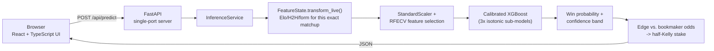

# Tennis Match Predictor.

A single-port, cross-platform local web app that predicts ATP match outcomes from 26
years of real historical data, with a calibrated-XGBoost inference engine, automatic
CUDA/CPU hardware detection, a walk-forward betting backtest, and zero manual
environment setup.

> **License:** [Non-Commercial Source-Available License v1.0](LICENSE) — free to view,
> run, and modify for personal, educational, and evaluation purposes (including
> technical/hiring-manager review and portfolio use). Commercial use, resale, and
> for-profit hosting are prohibited. See [License](#license) below.

## Executive Summary

The app ingests the full ATP men's tour history published on tennis-data.co.uk
(2000–2026), merges 27 season files (**71,074 raw match rows**), and runs them through
a feature-engineering pipeline that computes, match-by-match and in chronological order,
each player's **Elo rating, head-to-head record (overall and per-surface), recent-form
and streak, rest days, tournament fatigue, 30-day workload, and set-win percentage** —
the same signals a professional tennis trading desk would track. After cleaning
(numeric coercion, missing-data thresholds, player-identity deduplication), **25,076
enriched matches across 1,323 unique players** feed a calibrated XGBoost classifier
served over a single-port FastAPI backend, with a React/TypeScript frontend for
predictions, model diagnostics, and betting backtests.

Everything — hardware detection, dependency installation, data acquisition, and model
training — happens automatically the first time you run `python run.py`.

## System Architecture

### Data pipeline

```mermaid
flowchart LR
    A["tennis-data.co.uk\n(27 seasons, 2000-2026)"] -->|"download_raw_data()"| B["data/raw/*.xls[x]"]
    B -->|"merge_raw_data()"| C["final_dataset.csv\n71,074 rows"]
    C -->|"_generic_clean()"| D["Numeric coercion\nWRank/LRank/WPts/LPts/B365W/B365L"]
    D --> E["Player-name whitespace\nstripping (identity dedup)"]
    E -->|">40% missing columns dropped,\nmedian/mode imputation"| F["Cleaned tabular data\n25,076 rows / 1,323 players"]
    F -->|"FeatureState.fit()"| G["Elo · H2H · Form · Streak ·\nRest · Fatigue · Set-win %"]
    G --> H["final_dataset_clean_new.csv\n+ feature_state.pkl"]
```



### Runtime inference



## Tech Stack

| Layer | Technology | Role |
|---|---|---|
| **Backend** | FastAPI | REST API + serves the built frontend on one port |
| | XGBoost | Gradient-boosted match-outcome classifier (CUDA or CPU) |
| | scikit-learn | `StandardScaler`, `RFECV`, `CalibratedClassifierCV`, `RandomizedSearchCV` |
| | Pandas / NumPy | Data cleaning, feature engineering, backtest simulation |
| | Joblib | Model/artifact serialization (versioned registry) |
| | Uvicorn | ASGI server |
| | Requests / BeautifulSoup | ATP data acquisition from tennis-data.co.uk |
| **Frontend** | React 18 + TypeScript | Predict / Model & Data / Backtest UI |
| | Vite | Dev server + production build |
| | Tailwind CSS | Minimalist styling, light/dark aware |
| **Infrastructure** | `run.py` | Cross-platform launcher: venv bootstrap, hardware detect, data/model checks, LAN banner |
| | `start.bat` | Windows one-click entry point |
| | `sync_data.py` | Standalone, schedulable data-sync + retrain check |
| | `backend/hardware.py` | Two-stage CUDA detection with automatic CPU fallback |
| | `backend/ml/registry.py` | Versioned model artifacts (`models/<version>/`) |

## Key Engineering Highlights

- **Real bugs found and fixed against the live data source.** tennis-data.co.uk changed
  its file-naming scheme since older scrapers were written (`atp2024.xls` →
  `2024/2024.xlsx`); the scraper here also excludes the WTA (women's) files that share
  the same index page, coerces odds/points columns that occasionally arrive as mixed
  numeric/string data in older seasons, and strips whitespace-corrupted player names
  (e.g. `"Djokovic N."` vs `"Djokovic N. "`) that would otherwise fragment one player's
  Elo/H2H history into two identities.
- **Graceful CUDA → CPU fallback, verified, not assumed.** `backend/hardware.py` checks
  for an NVIDIA GPU via `nvidia-smi`, *then* independently confirms the installed
  XGBoost build can actually fit a model with `device="cuda"` before ever using it for
  real training — a GPU can be physically present while the installed XGBoost wheel is
  CPU-only, and this catches that case instead of crashing mid-training.
- **Accurate hardware-aware time estimates.** The first version of the fast/tuned
  training-time estimator was skewed by XGBoost/OpenMP's one-time thread-pool
  warm-up cost dominating a small timed probe (it predicted ~10 minutes for a fit that
  actually took under a minute). Fixed with an untimed warm-up fit before the real,
  timed probe — the estimate shown before every retrain is now grounded in actual
  per-tree throughput on your hardware.
- **Confidence scoring from real model internals, not a fabricated formula.** Every
  prediction reports a High/Medium/Low confidence label and a 95% band derived from the
  *disagreement between the 3 sub-models* inside the isotonic `CalibratedClassifierCV`
  ensemble — gated by how many real matches each player has on record, so a
  rarely-seen player can't produce a falsely confident prediction just because the
  ensemble happens to agree on thin data.
- **Leakage-free walk-forward backtesting.** The betting simulator retrains a fresh
  model on every season *before* the one it bets on and rolls forward — no model ever
  sees the outcomes it's being evaluated against.
- **Per-bet stake cap, added after the backtest exposed why it's necessary.** An early
  run with a 5% edge threshold and uncapped fractional-Kelly sizing wiped out the
  simulated bankroll almost to zero, despite a >55% win rate on every season — because
  Kelly sizing assumes the edge estimate is exact, and a low threshold was mostly
  qualifying calibration noise rather than a genuine market edge, so bet sizes
  compounded that error into ruin. `MAX_STAKE_FRACTION` in `backend/ml/backtest.py`
  caps any single bet, and the default edge threshold was raised accordingly. The
  backtest is a demonstration of rigorous, leakage-free evaluation methodology — real
  bookmaker markets are efficient and genuine edges are rare, so expect walk-forward
  ROI to often be flat or negative rather than a reliable money-maker.

## Project Structure

```
run.py                     # single-command launcher
start.bat                  # Windows helper
sync_data.py               # scheduled data-sync + retrain (cron / Task Scheduler)
requirements.txt

backend/
  app.py                   # FastAPI app: mounts API + serves frontend/dist
  config.py                # central path definitions
  hardware.py              # CUDA/CPU auto-detection
  launcher_common.py        # shared venv-bootstrap / LAN-IP helpers
  api/
    routes.py              # all HTTP endpoints
    schemas.py              # pydantic request/response models
  ml/
    pipeline.py              # download -> merge -> clean
    features.py               # FeatureState: Elo/H2H/form engine (train + live inference)
    train.py                   # fast/tuned trainer
    backtest.py                # walk-forward betting simulator
    estimate.py                 # hardware-aware training time estimates
    registry.py                  # versioned model artifacts
    sync.py                       # tennis-data.co.uk change detection
  services/
    inference.py               # loads active model, serves predictions + confidence
    train_job.py                 # background retrain job
    backtest_job.py               # background backtest job

frontend/                  # React + TypeScript + Vite + Tailwind
  src/
    App.tsx                 # Predict / Model & Data / Backtest tabs
    components/
    api/client.ts

data/                      # gitignored at runtime: raw + processed ATP data
models/                    # gitignored at runtime: versioned trained models
```

## Getting Started / Quickstart

**Prerequisites:** Python 3.10+. Node.js/npm is optional — only needed to build the
frontend from source; `run.py` does this automatically if `npm` is on `PATH`.

### Linux / macOS

```bash
python3 run.py
```

### Windows

Double-click `start.bat`, or:

```powershell
python run.py
```

### What happens on first run

1. Creates an isolated `.venv/` and installs `requirements.txt` — your system Python is
   never touched.
2. Detects an NVIDIA GPU (if present and CUDA-capable XGBoost is installed) or falls
   back to CPU automatically.
3. Downloads, merges, and cleans the full ATP dataset if `data/processed/` is empty.
4. If no model has been trained yet, benchmarks your hardware and asks you to choose
   **fast** (seconds to ~1 minute, fixed hyperparameters) or **tuned** (RFECV +
   bounded randomized hyperparameter search, several minutes) training — with a
   real time estimate for each, computed on your machine.
5. Builds the frontend (if `npm` is available) and starts serving on one port.
6. Prints a banner with both the local and LAN URLs:

```
+------------------------------------------+
|                                          |
|Tennis Match Predictor is running        |
|                                          |
|  Local:   http://127.0.0.1:8000         |
|  Network: http://192.168.1.42:8000      |
|                                          |
|Press Ctrl+C to stop.                    |
|                                          |
+------------------------------------------+
```

Open that URL from any device on your network — phone, tablet, another computer.

### Useful flags

```bash
python run.py --train fast       # force a fast (re)train before serving
python run.py --train tuned      # force a tuned (re)train before serving
python run.py --force-retrain    # retrain even if data hasn't changed
python run.py --no-train         # never train automatically; error if no model exists
python run.py --port 9000        # serve on a different port
```

### Keeping data fresh: `sync_data.py`

The running server never reaches out to the internet on its own. To pick up new
matches as a season progresses, schedule `sync_data.py` yourself — it checks the
current (and prior) season's file for changes and retrains only if something changed:

```bash
python sync_data.py                 # check + retrain (fast) if new data found
python sync_data.py --check-only    # just report whether new data is available
python sync_data.py --mode tuned    # retrain in tuned mode if new data is found
```

**Linux/macOS (cron)** — check daily at 3 AM:

```cron
0 3 * * * cd /path/to/project && .venv/bin/python sync_data.py >> sync.log 2>&1
```

**Windows (Task Scheduler)**:

```powershell
schtasks /create /tn "TennisPredictorSync" /tr "C:\path\to\.venv\Scripts\python.exe C:\path\to\sync_data.py" /sc daily /st 03:00
```

## API Reference

| Endpoint | Method | Purpose |
|---|---|---|
| `/api/health` | GET | Server status + hardware summary |
| `/api/players`, `/api/meta` | GET | Dropdown data (players, surfaces, rounds) |
| `/api/predict` | POST | Win probability, confidence band, optional edge/Kelly stake |
| `/api/model/info` | GET | Active model metadata, accuracy, feature importances |
| `/api/model/retrain` | POST | Start a background (re)train (`fast` or `tuned`) |
| `/api/model/train-status` | GET | Poll retrain progress |
| `/api/model/estimate` | GET | Hardware-aware fast/tuned time estimate |
| `/api/backtest` | POST | Start a walk-forward betting backtest |
| `/api/backtest/status` | GET | Poll backtest progress/result |
| `/api/data/sync-info` | GET | Last `sync_data.py` run's outcome |

## License

This project is released under a custom **[Non-Commercial Source-Available License
v1.0](LICENSE)**. In short:

- ✅ View, fork, run locally, and modify for personal or educational use.
- ✅ Technical evaluation by hiring managers/interviewers and portfolio review.
- ✅ Non-commercial research use.
- ❌ Any commercial use, resale, sublicensing, or for-profit SaaS hosting.

See the [LICENSE](LICENSE) file for the full terms. This is a template provided for
convenience, not legal advice — consult an attorney before relying on it for any
commercial or high-stakes context.
